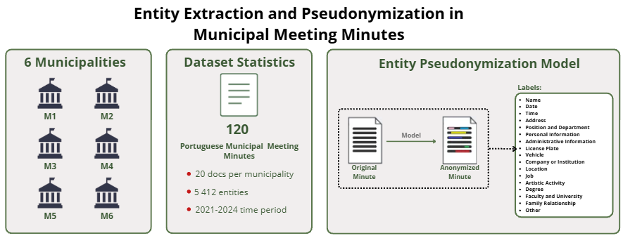

# CitiLink: Entity Extraction and Pseudonymization in Municipal Meeting Minutes

---

[](https://creativecommons.org/licenses/by-nd/4.0/)
[](https://www.python.org/downloads/)
[](https://pytorch.org/)


This repository presents a pseudonymization pipeline and a corresponding evaluation framework for de-identification and Information Extraction (IE) algorithms, specifically tailored for Portuguese Municipal Meeting Minutes. It details the pseudonymization dataset and provides a benchmark of state-of-the-art models used for the protection of Personally Identifiable Information (PII).
> The demo version is currently available at [Demo](https://huggingface.co/spaces/liaad/CitiLink-Pseudonymization-Demo).

<!-- Include a diagram if available -->
<div align="center">
    
</div>

---

## Table of Contents

1. [Description](#description)
2. [Project Status](#1-project-status)
3. [Technology Stack](#2-technology-stack)
4. [Dependencies](#3-dependencies)
5. [Installation](#4-installation)
6. [Usage](#5-usage)
7. [Dataset](#6-dataset)
8. [Architecture](#7-architecture)
9. [Evaluation Metrics](#8-evaluation-metrics)
10. [Experimental Settings & Results](#9-experimental-settings--results)
11. [Known Issues](#10-known-issues)
12. [License](#11-license)
13. [Resources](#12-resources)
14. [Acknowledgments](#13-acknowledgments)


---

## Description

This project provides a unified workflow for training, evaluating, and comparing de-identification and Named Entity Recognition (NER) algorithms, extended with a coreference resolution stage that ensures consistent pseudonymization across an entire document. This task involves identifying and protecting sensitive personal information (PII) within public documents, which is crucial for:

 - **Privacy & Compliance:** Ensuring adherence to GDPR and local data protection regulations by effectively detecting and masking sensitive identifiers.

 - **Data Security:** Automating the protection of personal information in large volumes of public records.

 - **Public Administration:** Facilitating the secure processing and sharing of municipal meeting minutes while preserving citizen privacy.

The framework supports two complementary tasks. First, NER identifies and classifies sensitive entities across 17 categories using a range of encoder and generative models. Second, coreference resolution links all mentions of the same entity throughout the document, so that every occurrence receives a consistent pseudonym identifier. Both tasks are evaluated independently and jointly through an end-to-end pseudonymization pipeline.

The dataset comprises 120 annotated minutes from 6 Portuguese municipalities across 17 categories: **Name**, **Administrative Information**, **Position or Department**, **Address**, **Date**, **Location**, **Other**, **Personal Document**, **Company**, **ArtisticActivity**, **Degree**, **Time**, **License Plate**, **Job**, **Vehicle**, **Faculty**, **Family Relationship**.

### Key Features

- **Context-Aware NER (XLM-RoBERTa):** Fine-tuned XLM-RoBERTa architecture providing robust multilingual entity recognition specifically trained to detect and classify PII in municipal documents.

- **Coreference Resolution:** A mention-ranking model (Lee et al., 2017) built on top of SpanBERT-PT, BERTimbau, Longformer and ModernBERT that links all coreferent mentions of the same entity across the document, enabling consistent pseudonym assignment.

- **Continued Pre-Training (SpanBERT-PT):** BERTimbau further pre-trained on Portuguese administrative text using Masked Language Modelling, producing a domain-adapted encoder specifically suited to the coreference task.

- **End-to-End Pseudonymization Pipeline:** NER and coreference are combined in a single pipeline (`pseudonymize.py`) that replaces each entity with a tagged pseudonym including a consistent numerical identifier (e.g., `<NAME-1>`).

- **Sliding Window Segmentation:** A preprocessing strategy that handles long meeting minutes by processing text in overlapping windows, ensuring that entities at the boundaries of text chunks are never truncated or missed.

- **Leave-One-Municipality-Out (LOMO) Evaluation:** A rigorous validation methodology that tests the model on entirely unseen municipalities, guaranteeing that the system generalises well across different administrative writing styles.

- **Granular Entity Classification:** Optimised to detect and categorise a wide range of PII using a precise BIO tagging scheme for high-fidelity pseudonymization.

- **Standardised Metric Tracking:** Integration with `seqeval` for NER evaluation and CoNLL metrics (MUC, B³, CEAF-e, LEA) for coreference evaluation.

- **Reproducible Experiments:** Complete environment configuration and version tracking to ensure that all model training and evaluation results are fully reproducible.

### Use Cases

This project is particularly useful for:

- **Automated PII Pseudonymization:** Efficient detection and consistent masking of personal data in administrative documents in European Portuguese (PT-PT).

---

## 1. Project Status

**Status**: ✅ Completed and Maintained

Core functionalities are stable and tested. The project has been used for academic research and is actively maintained. Bug fixes and minor improvements are ongoing.


## 2. Technology Stack

**Language**: Python 3.10+

**Core Frameworks**:
- **Hugging Face**: Provides the end-to-end pipeline for model architecture, tokenization, training, and evaluation (BERT, XLM-RoBERTa, Longformer, ModernBERT).
- **PyTorch**: The underlying deep learning framework used for training neural networks and tensor computations.
- **Seqeval**: Essential evaluation framework for computing precise NER metrics (Precision, Recall and F1-Score) at sequence level.

**Key Libraries**:
- `transformers` (4.40.0+): Core library for accessing, training, and deploying state-of-the-art transformer models.
- `datasets` (2.18.0+): Enables efficient loading, pre-processing, and management of the annotated municipal meeting minutes.
- `torch` (2.0.0+): The foundational deep learning framework for tensor computations and model training.
- `seqeval` (1.2.2+): Specialised framework for calculating precise sequence labelling metrics for NER tasks.
- `scikit-learn` (1.4.0+): Used for calculating statistical classification reports and generating confusion matrices.
- `scipy` (1.11.0+): Used for the CEAF-e coreference metric (linear assignment).
- `fastcoref` (2.1.6+): Provides zero-shot coreference baselines (LingMess and FCoref).
- `matplotlib` (3.7.0+): Used for generating performance visualisation charts and evaluation plots.
- `seaborn` (0.12.0+): High-level interface for creating detailed statistical visualisations.
- `google-generativeai` (0.5.0+): Client library for the Gemini API, used in the generative few-shot NER experiments.
- `bitsandbytes` (0.43.0+): Enables 4-bit quantisation for running GerVASIO 8B and AMALIA 9B locally.
- `accelerate` (0.29.0+): Required for `device_map="auto"` when loading large generative models.
- `huggingface-hub` (0.22.0+): Used for publishing and downloading models from the Hugging Face Hub.
- `safetensors` (0.4.0+): Safe and efficient format for saving and loading model weights.

**Development Tools**:
- Git for version control
- JSON for configuration management
- Markdown for documentation

---

## 3. Dependencies

All dependencies are specified in `requirements.txt`. See the file for the complete list.

```
torch>=2.0.0
transformers>=4.40.0
datasets>=2.18.0
evaluate>=0.4.0
seqeval>=1.2.2
scikit-learn>=1.4.0
pandas>=2.0.0
numpy>=1.24.0
matplotlib>=3.7.0
seaborn>=0.12.0
regex>=2025.11.3
fastcoref>=2.1.6
scipy>=1.11.0
google-generativeai>=0.5.0
bitsandbytes>=0.43.0
accelerate>=0.29.0
tqdm>=4.66.0
huggingface-hub>=0.22.0
safetensors>=0.4.0
```

### Installing Dependencies

**Full Installation** (includes all features):
```bash
pip install -r requirements.txt
```

### Additional Setup

1. **PyTorch with CUDA support (Crucial for WSL/GPU training):** Make sure you install the PyTorch version that matches your NVIDIA CUDA drivers to utilise hardware acceleration.

```bash
pip install torch --index-url https://download.pytorch.org/whl/cu118
```

2. **Baselines (SpaCy & Presidio):** To run the scripts in `baselines/ner/`, install SpaCy and Microsoft Presidio.

```bash
# Install SpaCy and Presidio packages
pip install spacy presidio-analyzer presidio-anonymizer

# Download the large Portuguese model for SpaCy
python -m spacy download pt_core_news_lg
```

3. **Coreference Baselines (LingMess & FCoref):** To run the scripts in `baselines/coref/`, install fastcoref.

```bash
pip install fastcoref
```

4. **Gemini API Key:** To run the few-shot experiments with Gemini 2.5 Pro, set your API key as an environment variable.

```bash
export GEMINI_API_KEY="your_api_key_here"
```

---
## 4. Installation

### Prerequisites
- Python 3.10 or higher
- CUDA-capable GPU (recommended, but CPU mode is supported)
- At least 8GB RAM (16GB recommended for training)

### Setup Steps

1. **Clone the repository**
```bash
git clone https://github.com/LIAAD/citilink_anonymization.git
cd citilink_anonymization
```

2. **Create and activate a virtual environment**
```bash
python -m venv venv
source venv/bin/activate  # On Windows: venv\Scripts\activate
```

3. **Install dependencies**
```bash
pip install -r requirements.txt
```

4. **Download PyTorch with GPU support**
```bash
pip install torch --index-url https://download.pytorch.org/whl/cu118
```

5. **Verify installation**
```bash
python -c "import torch; from transformers import AutoTokenizer, AutoModelForTokenClassification; import seqeval, spacy; print(f'CUDA Available: {torch.cuda.is_available()}'); print(f'Torch Version: {torch.__version__}'); print(f'Seqeval Version: {seqeval.__version__}'); tokenizer = AutoTokenizer.from_pretrained('xlm-roberta-base'); model = AutoModelForTokenClassification.from_pretrained('xlm-roberta-base', num_labels=35); print('Verification Successful')"
```

**Expected output:**
```
CUDA Available: True
Torch Version: 2.0.0+cu118
Seqeval Version: 1.2.2
Verification Successful
```

---

## 5. Usage

### Quick Start

#### Task 1 — NER: Training a Supervised Model

Train and evaluate a supervised NER model (XLM-RoBERTa, BERTimbau or Albertina) using the predefined train/val/test splits.

```bash
python src/ner/supervised/general_model/run_pipeline.py \
    --config xlmroberta   # or bertimbau, albertina
```

#### Task 1 — NER: Leave-One-Municipality-Out Cross-Validation (LOMO)

Evaluate the model's ability to generalise to unseen municipalities.

```bash
python src/ner/supervised/leave_one_municipality_out/run_pipeline.py \
    --config xlmroberta   # or bertimbau, albertina
```

#### Task 1 — NER: Few-Shot Evaluation with Generative Models

Run few-shot NER evaluation with Gemini 2.5 Pro, GerVASIO 8B or AMALIA 9B.

```bash
# Few-shot
python src/ner/generative/few_shot/evaluate.py \
    --config gemini_2_5_pro   # or gervasio_8b, amalia_9b

# Few-shot pipeline (generates pseudonymized output)
python src/ner/generative/few_shot/run_pipeline.py \
    --config gemini_2_5_pro --split test
```

#### Task 1 — NER: Fine-Tuned Generative Model (GerVASIO / AMALIA)

Evaluate the fine-tuned generative model on the test set.

```bash
python src/ner/generative/fine_tuned/evaluate.py \
    --model_path models/generative/fine_tuned/gervasio_8b

python src/ner/generative/fine_tuned/run_pipeline.py \
    --model_path models/generative/fine_tuned/gervasio_8b --split test
```

#### Task 2 — Coreference: Continued Pre-Training (SpanBERT-PT)

Adapt BERTimbau to the administrative domain via Masked Language Modelling before fine-tuning for coreference.

```bash
# Estimate training time first
python src/coref/supervised/continued_pretraining.py \
    --data_dir data/pretraining --estimate_only

# Run full continued pre-training
python src/coref/supervised/continued_pretraining.py \
    --data_dir data/pretraining --epochs 6
```

#### Task 2 — Coreference: Training a Supervised Model

Fine-tune a coreference model (SpanBERT-PT, BERTimbau, Longformer or ModernBERT) on the CitiLink-Minutes coreference dataset.

```bash
python src/coref/supervised/general_model/run_pipeline.py \
    --config spanbert_pt   # or bertimbau_coref, spanbert, longformer, modernbert
```

#### Task 2 — Coreference: Evaluation

Evaluate a trained coreference model on the test set, including per-class metrics.

```bash
python src/coref/supervised/general_model/evaluate.py \
    --config spanbert_pt
```

#### Full Pipeline — Pseudonymization

Pseudonymize a document using the NER model and the coreference model together. Each detected entity is replaced with a pseudonym tag that includes a consistent numerical identifier across the document.

```bash
# From a text string
python src/pseudonymize.py \
    --ner_model models/general_model/ner/xlmroberta \
    --coref_model models/general_model/coref/spanbert_pt \
    --text "O Presidente João Silva apresentou o processo 1/23. O pedido de João Silva foi aprovado."

# From a file
python src/pseudonymize.py \
    --ner_model models/general_model/ner/xlmroberta \
    --coref_model models/general_model/coref/spanbert_pt \
    --file sample_data/municipal_minutes/minutes_01.txt
```

**Example output:**
```
DETECTED ENTITIES
  Entity                                   Label                      ID  Confidence
  ──────────────────────────────────────────────────────────────────────────────────
  João Silva                               PERSONAL-NAME               1      0.9821
  João Silva                               PERSONAL-NAME               1      0.9743
  1/23                                     PERSONAL-ADMIN              1      0.9654

PSEUDONYMIZED TEXT
O Presidente <PERSONAL-NAME-1> apresentou o processo <PERSONAL-ADMIN-1>.
O pedido de <PERSONAL-NAME-1> foi aprovado.
```

#### End-to-End Evaluation

Evaluate the full pseudonymization pipeline (NER + coreference) on the test set, comparing predicted pseudonyms against the gold standard.

```bash
python src/evaluate_e2e.py \
    --ner_model   models/general_model/ner/xlmroberta \
    --coref_model models/general_model/coref/spanbert_pt \
    --json_dir    data/coreference_dataset \
    --output      src/results/e2e/metrics.json
```

#### Running Baselines

```bash
# NER baselines
python baselines/ner/baseline_spacy.py
python baselines/ner/baseline_presidio.py

# Coreference baselines
python baselines/coref/baseline_lingmess.py
python baselines/coref/baseline_fcoref.py
```

### Common Use Cases

#### Custom Configuration

All model hyperparameters are defined in `src/config/training_configs.json`. To add or modify a configuration, edit the file and pass the config name via `--config`.

```json
{
  "xlmroberta": {
    "model_name": "xlm-roberta-base",
    "max_length": 512,
    "learning_rate": 5e-05,
    "per_device_train_batch_size": 32,
    "num_train_epochs": 10,
    "weight_decay": 0.01,
    "eval_strategy": "yes",
    "save_strategy": "yes",
    "load_best_model_at_end": false,
    "bf16": true,
    "logging_steps": 50,
    "report_to": "none"
  },
  "spanbert_pt": {
    "model_name": "models/continued_pretraining/spanbert_pt",
    "max_tokens": 512,
    "stride": 128,
    "learning_rate": 2e-05,
    "encoder_lr_factor": 0.2,
    "epochs": 30,
    "grad_acc": 4,
    "patience": 5,
    "ffnn_dim": 1024,
    "dropout": 0.3,
    "max_span_width": 52,
    "max_antecedents": 50,
    "max_cluster_size": 12
  }
}
```

Then run with:
```bash
python src/ner/supervised/general_model/run_pipeline.py --config xlmroberta
python src/coref/supervised/general_model/run_pipeline.py --config spanbert_pt
```

#### GPU Selection

```bash
export TOKENIZERS_PARALLELISM=false
CUDA_VISIBLE_DEVICES=0 python src/ner/supervised/general_model/run_pipeline.py --config xlmroberta
```

### Output Structure

```
src/
└── results/
    ├── ner/
    │   ├── supervised/
    │   │   ├── general_model/
    │   │   │   ├── xlmroberta/
    │   │   │   │   └── metrics.json
    │   │   │   ├── bertimbau/
    │   │   │   └── albertina/
    │   │   └── leave_one_municipality_out/
    │   │       ├── xlmroberta/
    │   │       ├── bertimbau/
    │   │       └── albertina/
    │   └── generative/
    │       ├── few_shot/
    │       │   ├── gemini/
    │       │   ├── gervasio/
    │       │   └── amalia/
    │       └── fine_tuned/
    │           ├── gervasio/
    │           └── amalia/
    ├── coref/
    │   └── supervised/
    │       └── general_model/
    │           ├── spanbert_pt/
    │           │   └── metrics.json
    │           ├── bertimbau/
    │           ├── spanbert/
    │           ├── longformer/
    │           └── modernbert/
    └── e2e/
        └── metrics.json
```

### Key Hyperparameters

#### NER — Supervised Models (General Model)
| Parameter | Value |
| :--- | :--- |
| **model_name** | `xlm-roberta-base` |
| **max_length** | 512 |
| **learning_rate** | 5e-05 |
| **per_device_train_batch_size** | 32 |
| **num_train_epochs** | 10 |
| **weight_decay** | 0.01 |
| **eval_strategy** | yes |
| **save_strategy** | yes |
| **load_best_model_at_end** | false |
| **bf16** | true |
| **logging_steps** | 50 |
| **report_to** | none |

#### NER — Supervised Models (LOMO)
| Parameter | Value              |
| :--- |:-------------------|
| **model_name** | `xlm-roberta-base` |
| **max_length** | 512                |
| **learning_rate** | 5e-05              |
| **per_device_train_batch_size** | 16                 |
| **num_train_epochs** | 8                  |
| **weight_decay** | 0.012              |
| **eval_strategy** | yes                |
| **save_strategy** | yes                |
| **load_best_model_at_end** | false              |
| **bf16** | true               |
| **logging_steps** | 50                 |
| **report_to** | none               |

#### Coreference — Supervised Models
| Parameter | Value |
| :--- | :--- |
| **max_tokens** | 512 (SpanBERT-PT, BERTimbau) / 4096 (Longformer) / 8192 (ModernBERT) |
| **stride** | 128 (short-context) / 512 (long-context) |
| **learning_rate** | 2e-05 |
| **encoder_lr_factor** | 0.2 |
| **epochs** | 30 |
| **grad_acc** | 4 |
| **patience** | 5 |
| **ffnn_dim** | 1024 |
| **dropout** | 0.3 |
| **max_span_width** | 52 |
| **max_antecedents** | 50 |
| **max_cluster_size** | 12 |

---

## 6. Dataset

> **⚠️ Important Note for Reviewers**:
> - **Full Dataset**: The complete dataset statistics are shown below, but the full dataset files are **not yet available** in this repository.
> - **Sample Data**: This repository includes a sample of **1 annotated document** for each task for demonstration purposes. The full dataset will be made publicly available upon acceptance of the associated research paper.
> - **Interactive Testing**: To test the model and explore the full capabilities, please visit our **[Demo](https://huggingface.co/spaces/liaad/CitiLink-Pseudonymization-Demo)**


### Overview

**CitiLink-Minutes** **[Dataset](https://github.com/INESCTEC/citilink-dataset)** is a comprehensive repository of municipal meeting records. This project features two specialised sub-datasets: one for NER-based PII detection, and one for coreference resolution, both derived from the same 120 manually annotated minutes from 6 Portuguese municipalities.

### Dataset Statistics

| Attribute                      | Value                                               |
|--------------------------------|-----------------------------------------------------|
| **Total Documents**            | 120                                                 |
| **Municipalities**             | 6 (Alandroal, Campo Maior, Covilhã, Fundão, Guimarães, Porto) |
| **Documents per Municipality** | 20                                                  |
| **Total Tokens**               | ~1.3M                                               |
| **Average Entities per Document** | 45 entities                                      |
| **Total Coreference Clusters** | 998 (training set)                                  |
| **Language**                   | Portuguese (PT-PT)                                  |
| **Annotation Type**            | Privacy-sensitive entities, personal information and coreference links |
| **Domain**                     | Municipal government meetings                       |
| **Time Period**                | 2021–2024                                           |

### Dataset Structure

#### NER Dataset (`sample_data/personal_info_dataset/personal_info.json`)

```json
{
  "minute_id": "EXEMPLO_TAGS_2024_01",
  "tokens": ["No", "dia", "09", "de", "Agosto", ...],
  "tags": ["O", "O", "B-PERSONAL-DATE", "I-PERSONAL-DATE", ...],
  "personal_info": [
    {
      "type": "PERSONAL-DATE",
      "text": "09 de Agosto de 2015",
      "start": 7,
      "end": 27
    }
  ]
}
```

#### Coreference Dataset (`sample_data/coreference_dataset/coref_info.json`)

```json
{
  "doc_key": "Alandroal_cm_001_2024-01-03",
  "tokens": ["ATA", "N.º", "01", ...],
  "ner": [[57, 63, "PERSONAL-NAME"], [433, 434, "PERSONAL-ADMIN"], ...],
  "clusters": [
    [[57, 63], [80, 80]],
    [[433, 434], [443, 444]]
  ]
}
```

Each cluster groups all token spans that refer to the same real-world entity. Clusters are restricted to spans of the same NER class (e.g., a `NAME` span can only be linked to another `NAME` span).

### Data Files

- [personal_info.json](sample_data/personal_info_dataset/personal_info.json) — NER sample document
- [coref_info.json](sample_data/coreference_dataset/coref_info.json) — Coreference sample document
- [split_info.json](sample_data/split_info.json) — Train/val/test split information (shared by both tasks)

### Annotation Process

- **Source**: Official municipal meeting minutes provided by municipalities
- **Annotation Tool**: INCEpTION (https://inception-project.github.io/)
- **NER Guidelines**: Identifiable personal information is annotated, except for official roles (e.g., presidents and council members) that must remain visible.
- **Coreference Guidelines**: All mentions of the same entity are linked within the document, restricted to mentions of the same NER class.
- **Quality Control**: Annotation based on a detailed annotation manual to ensure consistency.

### Using the Dataset

#### Load the NER Dataset

```python
from dataset_processors import create_dataset_processor

processor = create_dataset_processor(
    'councilseg',
    dataset_path='sample_data/personal_info_dataset'
)

# Get test documents
test_docs = processor.get_documents(split='test')
```

#### LOMO Municipality-Based Evaluation

```python
municipalities = ['Alandroal', 'CampoMaior', 'Covilha', 'Fundao', 'Guimaraes', 'Porto']

# Train on N-1 municipalities, test on the remaining one
for test_mun in municipalities:
    train_muns = [m for m in municipalities if m != test_mun]
    # Create splits and train/evaluate
```

### Dataset Characteristics

**Challenges**:
- **Domain Specificity**: Municipal government jargon and formal language
- **Long Documents**: Average document length exceeds most transformer context windows
- **Entity Complexity**: Detecting 17 different types of personal data is difficult because they appear in various formats ranging from simple, fixed codes to complex, context-dependent phrases.
- **Coreference Complexity**: Entities are often referred to by abbreviations, partial names or pronouns across long documents.
- **Municipality Variation**: Different municipalities have different meeting structures.

**Advantages**:
- **Real-World Data**: Actual municipal meeting minutes, not synthetic
- **Dual Annotation**: Documents are annotated for both NER and coreference, enabling joint evaluation
- **Multiple Municipalities**: Enables generalisation testing via Leave-One-Municipality-Out Cross-Validation

---

## 7. Architecture

### System Architecture

The system is designed around two complementary tasks. The NER stage identifies and classifies sensitive entities using token classification models. The coreference stage links all mentions of the same entity across the document using a mention-ranking architecture. Both stages are combined in the pseudonymization pipeline, which assigns a consistent pseudonym identifier to each entity cluster.

<!-- Include a diagram if available -->
<div align="center">
    
</div>

### Component Descriptions

#### 1. NER Data Processing (`src/ner/supervised/general_model/run_pipeline.py`)
- **JSONL Parser:** Reads pre-chunked municipal text files, filtering out unknown tags and converting string labels into numeric IDs based on the 35-class BIO schema.
- **Token Aligner:** Aligns word-level annotations with the subword tokens generated by the XLM-RoBERTa tokenizer. It assigns a `-100` label to special tokens and subword continuations so they are ignored by the loss function.
- **Purpose:** Ensures that raw text annotations are perfectly translated into the tensor format required by the Transformer model without losing entity boundary precision.

#### 2. NER Model (`src/ner/supervised/general_model/run_pipeline.py`)
- **XLM-RoBERTa Base:** The foundational multilingual model loaded via `AutoModelForTokenClassification`, equipped with a linear classification head mapped to our 35 PII classes.
- **WeightedLossTrainer:** A custom subclass of the Hugging Face `Trainer`. It calculates class frequencies across the training set and overrides the `compute_loss` method to apply inverse frequency weighting to the `CrossEntropyLoss`.
- **Purpose:** The engine of the NER system. The custom trainer heavily penalises the model for missing minority classes (such as `PERSONAL-DEGREE` or `PERSONAL-JOB`), preventing the model from defaulting to the `O` (Outside) class.

#### 3. Continued Pre-Training (`src/coref/supervised/continued_pretraining.py`)
- **StreamingMLMDataset:** Reads Portuguese administrative text (meeting minutes and news) line by line without loading the full corpus into memory, tokenises in chunks and emits sequences of 512 tokens.
- **Masked Language Modelling:** Applies standard BERT MLM masking (80% `[MASK]`, 10% random, 10% unchanged) to adapt the BERTimbau encoder to the administrative domain.
- **Purpose:** Produces the SpanBERT-PT encoder, a domain-adapted version of BERTimbau that serves as the backbone for the coreference model.

#### 4. Coreference Model (`src/coref/supervised/general_model/run_pipeline.py`)
- **Span Representation:** Each entity span is represented as the concatenation of the start token embedding, the end token embedding, an attention-weighted head token embedding, and a span width embedding.
- **Mention Scorer:** A feed-forward network (FFNN) that scores each span as a potential mention, incorporating a positional embedding to account for the span's location in the document.
- **Antecedent Scorer:** A second FFNN that scores each candidate antecedent pair, combining the mention scores of both spans with a distance embedding.
- **Union-Find Clustering:** Pairs of spans that exceed the linking threshold are merged into clusters using a Union-Find structure, with a constraint that only spans of the same NER class can be linked.
- **Purpose:** Links all coreferent mentions of the same entity across the document, enabling the assignment of a consistent pseudonym identifier to each entity cluster.

#### 5. Pseudonymization Pipeline (`src/pseudonymize.py`)
- **NER Stage:** Runs the NER model on the input text and extracts entity spans with their character offsets and class labels.
- **Coreference Stage:** Converts the character-level spans to token-level spans and runs the coreference model to identify clusters of coreferent mentions.
- **ID Assignment:** Each cluster receives a sequential identifier per class (e.g., `<NAME-1>`, `<NAME-2>`). Mentions not linked by coreference but sharing the same exact text receive the same ID via exact-match fallback.
- **Replacement:** The text is rebuilt from right to left, replacing each entity span with its pseudonym tag to avoid index shifting.

#### 6. Evaluation Engine (`src/ner/supervised/general_model/evaluate.py`, `src/coref/supervised/general_model/evaluate.py`, `src/evaluate_e2e.py`)
- **NER Evaluation:** Uses `seqeval` to compute strict entity-level Precision, Recall and F1-Score, and `seaborn` to generate confusion matrices.
- **Coreference Evaluation:** Computes MUC, B³, CEAF-e, CoNLL F1 and LEA metrics, both overall and broken down by NER entity class.
- **End-to-End Evaluation:** Compares the full pipeline output against the gold standard, counting correctly pseudonymized entities, lost entities, incorrect substitutions and false positives.

### Data Flow Diagram

```
┌──────────────────────────────────────────┐
│  Input: Raw Municipal Meeting Minutes    │
└────────────────────┬─────────────────────┘
                     │
                     ▼
┌──────────────────────────────────────────┐
│  Task 1: NER — Entity Detection          │
│  (XLM-RoBERTa + BIO tagging)            │
└────────────────────┬─────────────────────┘
                     │
                     ▼
┌──────────────────────────────────────────┐
│  Task 2: Coreference Resolution          │
│  (SpanBERT-PT mention-ranking model)     │
└────────────────────┬─────────────────────┘
                     │
                     ▼
┌──────────────────────────────────────────┐
│  Pseudonymization                        │
│  (Consistent IDs per entity cluster)    │
│  e.g. João Silva → <NAME-1>             │
└────────────────────┬─────────────────────┘
                     │
                     ▼
┌──────────────────────────────────────────┐
│  Output: Pseudonymized Text + Metrics    │
└──────────────────────────────────────────┘
```

---

## 8. Evaluation Metrics

### NER Metrics

The NER models are evaluated using standard Named Entity Recognition metrics at the entity level (strict matching via `seqeval`).

#### Precision
- **Description:** Measures the accuracy of detections — how reliable the entities found by the model are.
- **Formula:** `TP / (TP + FP)`

#### Recall
- **Description:** Measures the completeness of detections — how much of the actual sensitive data was successfully found.
- **Formula:** `TP / (TP + FN)`

#### F1-Score
- **Description:** The harmonic mean of Precision and Recall.
- **Formula:** `2 * (Precision * Recall) / (Precision + Recall)`

### Coreference Metrics

Coreference resolution is evaluated using the standard CoNLL coreference metrics.

#### MUC
Measures how many predicted clusters correctly partition the gold mention sets. Focuses on the links between mentions.

#### B³
Measures the overlap between predicted and gold clusters at the mention level. Sensitive to both precision and recall of cluster membership.

#### CEAF-e
Aligns predicted and gold clusters optimally and measures entity-level similarity.

#### CoNLL F1
The average of MUC F1, B³ F1 and CEAF-e F1. The primary coreference metric reported in the literature.

#### LEA
Link-based Entity Aware metric. Measures the proportion of within-cluster links that are correctly predicted.

### End-to-End Pseudonymization Metrics

The end-to-end pipeline is evaluated by comparing predicted pseudonyms against the gold standard at the span level.

| Category | Description |
| :--- | :--- |
| **Correctly pseudonymized** | Span detected, class correct, cluster ID consistent with gold |
| **Lost** | Gold span not detected by NER |
| **Incorrect substitutions** | Span detected but class wrong or cluster ID inconsistent |
| **False positives** | Span predicted with no corresponding gold span |

---

## 9. Experimental Settings & Results

### Task 1 — NER: General Model

The following results were obtained on the test set using strict entity-level evaluation (`seqeval`).

| Type | Model | F1 macro (%) | F1 micro (%) | P macro (%) | P micro (%) | R macro (%) | R micro (%) |
|:---|:---|:---:|:---:|:---:|:---:|:---:|:---:|
| Reference Tools | Microsoft Presidio | 30.54 | 36.65 | 32.28 | 34.98 | 31.05 | 38.46 |
| Reference Tools | SpaCy | 25.87 | 31.21 | 25.16 | 29.32 | 26.92 | 33.33 |
| Encoder Models | Albertina 1.5B | 64.13 | 84.39 | 65.36 | 82.25 | 64.21 | 86.64 |
| Encoder Models | BERTimbau | 72.08 | 82.89 | 74.95 | 79.84 | 72.85 | 86.06 |
| Encoder Models | **XLM-RoBERTa** | **72.67** | **83.51** | **71.21** | **79.77** | **74.87** | **87.85** |
| Decoder (few-shot) | Gemini 2.5 Pro | 29.95 | 35.13 | 22.36 | 23.91 | 61.04 | 66.13 |
| Decoder (few-shot) | GerVASIO 8B | 22.24 | 30.23 | 21.07 | 26.27 | 23.60 | 35.75 |
| Decoder (few-shot) | AMALIA 9B | 16.97 | 25.21 | 16.11 | 23.33 | 17.89 | 27.44 |
| Decoder (fine-tuned) | GerVASIO 8B (FT) | 50.24 | 57.23 | 48.15 | 54.60 | 52.52 | 60.13 |
| Decoder (fine-tuned) | AMALIA 9B (FT) | 44.97 | 51.21 | 42.35 | 48.20 | 47.94 | 54.62 |

### Task 1 — NER: Leave-One-Municipality-Out (LOMO)

| Municipality | Model | F1 macro (%) | F1 micro (%) |
|:---|:---|:---:|:---:|
| Alandroal | Albertina 1.5B | 58.43 | 74.91 |
| Alandroal | BERTimbau | 65.51 | 73.04 |
| Alandroal | XLM-RoBERTa | 66.47 | 74.02 |
| Campo Maior | Albertina 1.5B | 38.25 | 52.64 |
| Campo Maior | BERTimbau | 41.08 | 48.53 |
| Campo Maior | XLM-RoBERTa | 45.52 | 52.09 |
| **Average** | **Albertina 1.5B** | **49.01** | **62.52** |
| **Average** | **BERTimbau** | **50.74** | **58.06** |
| **Average** | **XLM-RoBERTa** | **54.62** | **61.89** |

### Task 2 — Coreference: General Model

| Model | MUC F1 (%) | B³ F1 (%) | CEAF-e F1 (%) | CoNLL F1 (%) | LEA F1 (%) |
|:---|:---:|:---:|:---:|:---:|:---:|
| LingMess (zero-shot) | 0.00 | 55.70 | 0.00 | 18.57 | 0.00 |
| FCoref (zero-shot) | 93.60 | 60.70 | 18.20 | 57.47 | 14.30 |
| BERTimbau | 88.80 | 87.50 | 77.90 | 84.70 | 71.50 |
| SpanBERT | 86.50 | 86.30 | 75.90 | 82.90 | 71.00 |
| Longformer | 88.50 | 86.20 | 75.30 | 83.40 | 67.80 |
| ModernBERT | 88.90 | 88.00 | 80.50 | 85.80 | 72.90 |
| **SpanBERT-PT** | **91.50** | **89.50** | **81.20** | **87.40** | **74.80** |

### End-to-End Pseudonymization

| Metric | Value |
|:---|:---:|
| Correctly pseudonymized entities | 1050 |
| Lost entities (not detected) | 310 |
| Incorrect substitutions | 200 |
| False positives | 203 |
| **Precision (%)** | **72.26** |
| **Recall (%)** | **71.38** |
| **F1-Score (%)** | **71.81** |

---

## 10. Known Issues

### Current Limitations

1. **Class Imbalance**: Low recall on rare entities (e.g., `DEGREE`, `FAMILY`).
   - **Workaround**: Implemented a `WeightedLossTrainer` to penalise minority class errors.
   - **Future Work**: Synthetic data augmentation.

2. **Context Limits**: XLM-RoBERTa's 512-token cap can fragment long documents.
   - **Workaround**: Overlapping sliding windows during preprocessing.

3. **Entity Ambiguity**: Confusion between person names and locations named after people (e.g., "Rua Almeida Garrett").

4. **Coreference Span Alignment**: The end-to-end pipeline converts character-level NER spans to token-level spans via a whitespace tokenisation heuristic, which may introduce minor misalignments in documents with non-standard spacing.

### Reporting Issues

Please report issues on GitHub:
- Python and library versions
- GPU model and CUDA version (if applicable)
- Steps to reproduce the issue
- Error traceback or unexpected output


---

## 11. License

This project is licensed under **CC-BY-ND 4.0** (Creative Commons Attribution-NoDerivatives 4.0 International).

You are free to:
- **Share**: Copy and redistribute the material in any medium or format

Under the following terms:
- **Attribution**: You must give appropriate credit
- **NoDerivatives**: If you remix, transform, or build upon the material, you may not distribute the modified material

See [LICENSE](LICENSE) file for details.

### Dataset License

The CitiLink-Minutes dataset is derived from public municipal meeting minutes and is provided for research purposes only. Original documents are copyright their respective municipal governments.

---

## 12. Resources

### Models

The pre-trained models are available for download:

- **NER (XLM-RoBERTa)**: [liaad/CitiLink-XLMR-Anonymization-pt](https://huggingface.co/liaad/CitiLink-XLMR-Anonymization-pt)
- **Coreference (SpanBERT-PT)**: [liaad/CitiLink-SpanBERT-Coreference-pt](https://huggingface.co/liaad/CitiLink-SpanBERT-Coreference-pt)

### Demo

An interactive demo of the full pseudonymization pipeline is available on Hugging Face Spaces:

- **CitiLink Pseudonymization Demo**: [liaad/Citilink-Text-Pseudonymization-Demo](https://huggingface.co/spaces/liaad/CitiLink-Pseudonymization-Demo)

## 13. Acknowledgments

---

- Municipal governments of Alandroal, Campo Maior, Covilhã, Fundão, Guimarães and Porto for providing meeting minutes
- INCEpTION project for the annotation tool
- Hugging Face for model hosting and transformers library
- MACC / Deucalion HPC cluster for computational resources (projects F202500017 and F202600025)

## 14. Citation

Coming Soon...


---

**Template Version**: 2.0  
**Last Updated**: July 3, 2026  
**Maintained by**: Tiago Marques, CitiLink Team, LIAAD/INESC TEC, University of Beira Interior