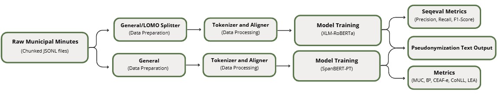

# CitiLink: Entity Extraction and Anonymization in Municipal Meeting Minutes

---

[](https://creativecommons.org/licenses/by-nd/4.0/)
[](https://www.python.org/downloads/)
[](https://pytorch.org/)


This repository presents an anonymization task and a corresponding evaluation framework for de-identification and Information Extraction (IE) algorithms, specifically tailored for Portuguese Municipal Meeting Minutes. It details the anonymization dataset and provides a benchmark of state-of-the-art models used for the protection of Personally Identifiable Information (PII).
> The demo version is currently available at [Demo](https://huggingface.co/spaces/liaad/Citilink-Text-Anonymization-Demo).

<!-- Include a diagram if available -->
<div align="center">
    
</div>

---

## Table of Contents

1. [Description](#description)
2. [Project Status](#1-project-status)
3. [Technology Stack](#2-technology-stack)
4. [Dependencies](#3-dependencies)
5. [Installation](#4-installation)
6. [Usage](#5-usage)
7. [Dataset](#6-dataset) 
8. [Architecture](#7-architecture)
9. [Evaluation Metrics](#8-evaluation-metrics)
10. [Hyperparameter Tuning](#9-hyperparameter-tuning) 
11. [Known Issues](#10-known-issues)
12. [License](#11-license)
13. [Resources](#12-resources)
14. [Acknowledgments](#13-acknowledgments)


---

## Description

This project provides a unified workflow for training, evaluating, and comparing de-identification and Named Entity Recognition (NER) algorithms. This task involves identifying and protecting sensitive personal information (PII) within public documents, which is crucial for:

 - **Privacy & Compliance:** Ensuring adherence to GDPR and local data protection regulations by effectively detecting and masking sensitive identifiers.

 - **Data Security:** Automating* the protection of personal information in large volumes of public records.

 - **Public Administration:** Facilitating the secure processing and sharing of municipal meeting minutes while preserving citizen privacy.

The framework supports various algorithms and includes our new anonymization dataset, featuring 120 annotated minutes from 6 Portuguese municipalities across 17 categories, namely: **Name**, **Administrative Information**, **Position or Department**, **Address**, **Date**, **Location**, **Other**, **Personal Document**, **Company**, **ArtisticActivity**, **Degree**, **Time**, **License Plate**, **Job**, **Vehicle**, **Faculty**, **Family Relationship**.

### Key Features
- **Context-Aware NER (XLM-RoBERTa):** Fine-tuned XLM-RoBERTa architecture, providing robust multilingual entity recognition capabilities specifically trained to detect and classify Personally Identifiable Information (PII) in municipal documents.

- **Sliding Window Segmentation:** A preprocessing strategy that handles lengthy and complex meeting minutes by processing text in overlapping windows, ensuring that entities at the boundaries of text chunks are never truncated or missed.

- **Leave-One-Municipality-Out (LOMO) Evaluation:** A rigorous validation methodology that tests the model on entirely unseen municipalities, guaranteeing that the system generalizes well across different administrative writing styles and does not simply memorize local patterns.

- **Granular Entity Classification:** Optimized to detect and categorize a wide range of PII (Names, Addresses, License Plates, Job Titles, Dates, etc.) using a precise BIO tagging scheme for high-fidelity de-identification.

- **Standardized Metric Tracking:** Integration with seqeval for sequence-level evaluation, providing accurate F1-Score, Precision, and Recall metrics essential for measuring the reliability of the anonymization process.

- **Generalization vs. Specialization:** Supports both "General Model" (trained on all municipalities) and "Intra-Municipality" (trained on specific data) workflows to balance broad coverage with local accuracy.

- **Reproducible Experiments:** Complete environment configuration and version tracking (transformers, torch, seqeval) to ensure that all model training and evaluation results are fully reproducible.

### Use Cases


This project is particularly useful for:

- **Automated PII Anonymization:** Efficient detection and masking of personal data in administrative documents in European Portuguese (PT-PT)

---

## 1. Project Status

**Status**: ✅ Completed and Maintained

Core functionalities are stable and tested. The project has been used for academic research and is actively maintained. Bug fixes and minor improvements are ongoing.


## 2. Technology Stack

**Language**: Python Python 3.10+

**Core Frameworks**:
- **Hugging Face**: Provides the end-to-end pipeline for model architecture, tokenization, training, and evaluation (BERT, XLM-RoBERTa).
- **PyTorch**: The underlying deep learning framework used for training neural networks and tensor computations.
- **Seqeval**: Framework de avaliação essencial para calcular métricas precisas de NER (Precision, Recall e F1-Score) ao nível da sequência.

**Key Libraries**:
- `transformers` (5.0.0+): Core library for accessing, training, and deploying state-of-the-art transformer models.

- `datasets` (4.4.1+): Enables efficient loading, pre-processing, and management of the annotated municipal meeting minutes.

- `torch` (2.7.1+cu118+): The foundational deep learning framework for tensor computations and model training.

- `seqeval` (1.2.2+): Specialized framework for calculating precise sequence labeling metrics (Precision, Recall, F1-Score) for NER tasks.

- `scikit-learn` (1.7.2+): Used for calculating statistical classification reports and generating confusion matrices.

- `matplotlib` (3.10.7+): Used for generating performance visualization charts and evaluation plots.

- `seaborn` (0.13.2+): High-level interface for creating detailed statistical visualizations, such as error analysis heatmaps.


**Development Tools**:
- Git for version control
- JSON for configuration management
- Markdown for documentation

---

## 3. Dependencies

All dependencies are specified in `requirements.txt`. See the file for the complete list.

```
torch>=2.0.0
transformers>=4.40.0
datasets>=2.18.0
evaluate>=0.4.0
seqeval>=1.2.2
scikit-learn>=1.4.0
pandas>=2.0.0
numpy>=1.24.0
matplotlib>=3.7.0
seaborn>=0.12.0
regex>=2025.11.3
```

### Installing Dependencies

**Full Installation** (includes all features):
```bash
pip install -r requirements.txt
```

### Additional Setup

1. **PyTorch with CUDA support (Crucial for WSL/GPU training):** Make sure you install the PyTorch version that matches your NVIDIA CUDA drivers to utilize hardware acceleration.

```bash
pip install torch --index-url https://download.pytorch.org/whl/cu118
```

2. **Baselines (SpaCy & Presidio):** To run the scripts located in the baselines/ directory, you need to install the SpaCy NLP library (along with a Portuguese language model) and Microsoft Presidio for rule-based anonymization.

```bash
# Install SpaCy and Presidio packages
pip install spacy presidio-analyzer presidio-anonymizer

# Download the large Portuguese model for SpaCy
python -m spacy download pt_core_news_lg
```
---
## 4. Installation

### Prerequisites
- Python 3.10 or higher
- CUDA-capable GPU (recommended, but CPU mode is supported)
- At least 8GB RAM (16GB recommended for training)

### Setup Steps

1. **Clone the repository**
```bash
git clone https://github.com/LIAAD/citilink_anonymization.git
cd citilink_anonymization
```

2. **Create and activate a virtual environment**
```bash
python -m venv venv
source venv/bin/activate  # On Windows: venv\Scripts\activate
```

3. **Install dependencies**
```bash
pip install -r requirements.txt
```

4. **Download PyTorch with GPU support**
```bash
pip install torch --index-url https://download.pytorch.org/whl/cu118
```

5. **Verify installation** Run a quick check to confirm that PyTorch can access the GPU and Transformers can load the model components.
```bash
python -c "import torch; from transformers import AutoTokenizer, AutoModelForTokenClassification; import seqeval, spacy; print(f'CUDA Available: {torch.cuda.is_available()}'); print(f'Torch Version: {torch.__version__}'); print(f'Seqeval Version: {seqeval.__version__}'); tokenizer = AutoTokenizer.from_pretrained('xlm-roberta-base'); model = AutoModelForTokenClassification.from_pretrained('xlm-roberta-base', num_labels=35); print('Verification Successful')"
```

**Expected output:**
```
CUDA Available: True
Torch Version: 2.7.1+cu118
Seqeval Version: 1.2.2
Verification Successful
```

---

## 5. Usage

### Quick Start

#### Running a Single Experiment

Train and evaluate the XLM-RoBERTa or Bert-Base NER model using the predefined training, validation, and test splits across all municipal data.

```bash
python src/general_model/run_pipeline.py \
    --config xlm_roberta \  # or bert_base
    --model_name "xlm-roberta-base" \  # or "neuralmind/bert-base-portuguese-cased"
    --data_dir "municipal_minutes" \
    --output_dir "src/results/general_model"
```
Expected output:
```
Model: xlm-roberta-base # or bert-base-multilingual-cased
Device: cuda # or cpu
Success: Loaded 72 training docs and 24 validation docs.
Starting training
...
Results saved in results/xlm_roberta/model_anonymization
```
#### Running Leave-One-Municipality-Out Cross-Validation (LOMO)

Evaluate the model's ability to generalize to unseen municipal writing styles by running a full LOMO pipeline.

```bash
python src/leave_one_municipality_out/run_pipeline.py \
    --config xlm_roberta \  # or bert_base
    --model_name "xlm-roberta-base" \ # or "neuralmind/bert-base-portuguese-cased"
    --data_dir "municipal_minutes" \
    --output_dir "src/results/leave_one_municipality_out"
    --target_municipality "M1"  # or M2, M3, etc. (the municipality to leave out for testing)
```

Expected output:

```
Model: xlm_roberta | Device: cuda
Starting LOMO for 6 municipalities: ['M1', 'M2', 'M3', 'M4', 'M5', 'M6']
LOMO ITERATION: Leaving out M1 # or M2, M3, etc.
Data Split: 
Train: 62 docs
Validation: 20 docs
Starting training for hold-out M1
...
Model for M1 saved in models/leave_one_municipality_out/xlm_roberta/M1
```
### Common Use Cases

#### Anonymizing Raw Text (Inference)

Run the trained model on a new, raw municipal document to extract and mask PII (Personally Identifiable Information).

```bash
python anonymize.py \
    --model_path "src/models/xlm_roberta/model_anonymization" \
    --input_file "sample_data/municipal_minutes/minutes_01.txt" \
    --output_file "sample_data/minutes_anonymized/minutes_01_anon.txt"
```

**Parameters**:
- `--model_path`: Path to the fine-tuned model checkpoint.
- `--input_file`: Raw text file to be anonymized.
- `--output_file`: Path to save the masked text (where entities are replaced by their tags like [PERSONAL-NAME]).

### Advanced Usage

#### Custom Configuration

Create a custom configuration in `src/config/training_configs.json` to fine-tune the pipeline without passing dozens of command-line arguments.

```python
# Example configuration
{
  "xlm_roberta": {
    "model_name": "xlm-roberta-base",
    "max_length": 512,
    "learning_rate": 5e-05,
    "per_device_train_batch_size": 32,
    "num_train_epochs": 10,
    "weight_decay": 0.01,
    "eval_strategy": "yes",
    "save_strategy": "yes",
    "load_best_model_at_end": false,
    "bf16": true,
    "logging_steps": 50,
    "report_to": "none"
  },
  "bert_base": {
    "model_name": "neuralmind/bert-base-portuguese-cased",
    "max_length": 512,
    "learning_rate": 5e-05,
    "per_device_train_batch_size": 32,
    "num_train_epochs": 10,
    "weight_decay": 0.01,
    "eval_strategy": "yes",
    "save_strategy": "yes",
    "load_best_model_at_end": false,
    "bf16": true,
    "logging_steps": 50,
    "report_to": "none"
  }
}
```

Then run with:
```bash
python src/general_model/run_pipeline.py --config xlm_roberta # or bert_base
```

#### GPU Selection and Parallelism Constraints

Force the script to use a specific GPU, whilst ensuring tokenizer parallelism is safely disabled.

```bash
export TOKENIZERS_PARALLELISM=false
CUDA_VISIBLE_DEVICES=1 python src/general_model/run_pipeline.py
```

### Output Structure

Results are automatically saved in the directories specified in the configuration, maintaining a clear separation between model weights and evaluation metrics.

```
src/
├── models/
│   ├── general_model/
│   │   ├── xlm_roberta/                # Model weights, tokenizer, config files
│   │   └── bert_base/
│   └── leave_one_municipality_out/
│       ├── xlm_roberta/
│       │   ├── M1/                     # Trained model excluding M1
│       │   ├── M2/                     # Trained model excluding M2
│       │   └── ...
│       └── bert_base/
│
└── results/
    ├── general_model/
    │   ├── xlm_roberta/
    │   │   ├── metrics.json
    │   │   └── confusion_matrix.png
    │   └── bert_base/
    └── leave_one_municipality_out/
        ├── xlm_roberta/
        │   ├── M1/                     # Local metrics (metrics_Alandroal.json)
        │   ├── M2/                     # Local metrics
        │   ├── global_metrics.json     # Combined metrics from all municipalities
        │   └── global_confusion_matrix.png
        └── bert_base/
```

### Key Hyperparameters

####  Entity Anonymization — General Model
| Parameter | Value |
| :--- | :--- |
| **model_name** | `xlm-roberta-base` |
| **max_length** | 512 |
| **learning_rate** | 5e-05 |
| **per_device_train_batch_size** | 32 |
| **num_train_epochs** | 10 |
| **weight_decay** | 0.01 |
| **eval_strategy** | yes |
| **save_strategy** | yes |
| **load_best_model_at_end** | false |
| **bf16** | true |
| **logging_steps** | 50 |
| **report_to** | none |

#### Entity Anonymization — Leave-One-Out / In-Municipality
| Parameter | Value              |
| :--- |:-------------------|
| **model_name** | `xlm-roberta-base` |
| **max_length** | 512                |
| **learning_rate** | 5e-05              |
| **per_device_train_batch_size** | 16                 |
| **num_train_epochs** | 8                  |
| **weight_decay** | 0.012              |
| **eval_strategy** | yes                |
| **save_strategy** | yes                |
| **load_best_model_at_end** | false              |
| **bf16** | true               |
| **logging_steps** | 50                 |
| **report_to** | none               |
---

## 6. Dataset

> **⚠️ Important Note for Reviewers**:
> - **Full Dataset**: The complete dataset statistics are shown below, but the full dataset files are **not yet available** in this repository.
> - **Sample Data**: This repository only includes a sample of **1 annotated document** for demonstration purposes  The full dataset will be made publicly available upon acceptance of the associated research paper.
> - **Interactive Testing**: To test the model on this example and explore the full capabilities, please visit our **[Demo](https://huggingface.co/spaces/liaad/Citilink-Text-Anonymization-Demo)**


### Overview

**CitiLink-Minutes** **[Dataset](https://github.com/INESCTEC/citilink-dataset)** is a comprehensive repository of municipal meeting records. This project features a specialized sub-dataset for PII anonymization, consisting of 120 manually annotated minutes from 6 Portuguese municipalities, covering 17 distinct sensitive entity categories.

### Dataset Statistics

| Attribute | Value                                               |
|-----------|-----------------------------------------------------|
| **Total Documents** | 120                                                 |
| **Municipalities** | 6 (M1, M2, M3, M4, M5, M6)                          |
| **Documents per Municipality** | 20                                                  |
| **Average Segments per Document** | 45 entities                                         |
| **Language** | Portuguese (PT)                                     |
| **Annotation Type** | Privacy-sensitive entities and personal information |
| **Domain** | Municipal government meetings                       |
| **Time Period** | 2021-2024                                           |

### Dataset Structure

The dataset is stored in JSON format with the following structure:

```json
{
  {
  "Municipality_Name": {
    "documents": [
      {
        "document_id": "Municipality_cm_XXX_YYYY-MM-DD",
        "full_text": "No dia 09 de Agosto de 2015, às 20:01 m, o Chefe da Divisão de Higiene Urbana, Sr. Ana-Laura Torres, Licenciado em Gestão pela Universidade Aberta, residente na Av Eva Jesus, Alverca do Ribatejo, em Turquemenistão, acompanhado pelo seu esposo, que trabalha como Técnico de controlo de instalações da indústria química, chegou na sua Mercedes-Benz EQC de matrícula 76-41-46. O processo 4800 da empresa Anita Amorim - Serviços, associado ao NIF 3721/217, trata de painel de azulejos e 2.º andar.",
        "tokens": ["No", "dia", "09", "de", "Agosto", "de", "2015", ",", "às", "20", ":", "01", "m", ",", "o", "Chefe", "da", "Divisão", "de", "Higiene", "Urbana", ",", "Sr", ".", "Ana", "-", "Laura", "Torres", ",", "Licenciado", "em", "Gestão", "pela", "Universidade", "Aberta", ",", "residente", "na", "Av", "Eva", "Jesus", ",", "Alverca", "do", "Ribatejo", ",", "em", "Turquemenistão", ",", "acompanhado", "pelo", "seu", "esposo", ",", "que", "trabalha", "como", "Técnico", "de", "controlo", "de", "instalações", "da", "indústria", "química", ",", "chegou", "na", "sua", "Mercedes", "-", "Benz", "EQC", "de", "matrícula", "76", "-", "41", "-", "46", ".", "O", "processo", "4800", "da", "empresa", "Anita", "Amorim", "-", "Serviços", ",", "associado", "ao", "NIF", "3721", "/", "217", ",", "trata", "de", "painel", "de", "azulejos", "e", "2", ".", "º", "andar", "."],
        "tags": ["O", "O", "B-PERSONAL-DATE", "I-PERSONAL-DATE", "I-PERSONAL-DATE", "I-PERSONAL-DATE", "I-PERSONAL-DATE", "O", "O", "B-PERSONAL-TIME", "I-PERSONAL-TIME", "I-PERSONAL-TIME", "I-PERSONAL-TIME", "O", "O", "B-PERSONAL-POSITION", "I-PERSONAL-POSITION", "I-PERSONAL-POSITION", "I-PERSONAL-POSITION", "I-PERSONAL-POSITION", "I-PERSONAL-POSITION", "O", "O", "O", "B-PERSONAL-NAME", "I-PERSONAL-NAME", "I-PERSONAL-NAME", "I-PERSONAL-NAME", "O", "O", "O", "B-PERSONAL-DEGREE", "O", "B-PERSONAL-FACULTY", "I-PERSONAL-FACULTY", "O", "O", "O", "B-PERSONAL-ADDRESS", "I-PERSONAL-ADDRESS", "I-PERSONAL-ADDRESS", "I-PERSONAL-ADDRESS", "I-PERSONAL-ADDRESS", "I-PERSONAL-ADDRESS", "I-PERSONAL-ADDRESS", "O", "O", "B-PERSONAL-LOCATION", "O", "O", "O", "O", "B-PERSONAL-FAMILY", "O", "O", "O", "O", "B-PERSONAL-JOB", "I-PERSONAL-JOB", "I-PERSONAL-JOB", "I-PERSONAL-JOB", "I-PERSONAL-JOB", "I-PERSONAL-JOB", "I-PERSONAL-JOB", "I-PERSONAL-JOB", "O", "O", "O", "O", "B-PERSONAL-VEHICLE", "I-PERSONAL-VEHICLE", "I-PERSONAL-VEHICLE", "I-PERSONAL-VEHICLE", "O", "O", "B-PERSONAL-LICENSE", "I-PERSONAL-LICENSE", "I-PERSONAL-LICENSE", "I-PERSONAL-LICENSE", "I-PERSONAL-LICENSE", "O", "O", "O", "B-PERSONAL-ADMIN", "O", "O", "B-PERSONAL-COMPANY", "I-PERSONAL-COMPANY", "I-PERSONAL-COMPANY", "I-PERSONAL-COMPANY", "O", "O", "O", "O", "B-PERSONAL-INFO", "I-PERSONAL-INFO", "I-PERSONAL-INFO", "O", "O", "O", "B-PERSONAL-ARTISTIC", "I-PERSONAL-ARTISTIC", "I-PERSONAL-ARTISTIC", "O", "B-PERSONAL-OTHER", "I-PERSONAL-OTHER", "I-PERSONAL-OTHER", "I-PERSONAL-OTHER", "O"],
        "entities": [
            {
              "type": "PERSONAL-DATE",
              "text": "09 de Agosto de 2015",
              "start": 7,
              "end": 27
            },
            {
              "type": "PERSONAL-TIME",
              "text": "20:01 m",
              "start": 32,
              "end": 39
            },
            {
              "type": "PERSONAL-POSITION",
              "text": "Chefe da Divisão de Higiene Urbana",
              "start": 43,
              "end": 77
            },
            {
              "type": "PERSONAL-NAME",
              "text": "Ana-Laura Torres",
              "start": 83,
              "end": 99
            },
            {
              "type": "PERSONAL-DEGREE",
              "text": "Gestão",
              "start": 115,
              "end": 121
            { ... },
            { ... }
        ]
      }
    ]
  }
}    
```

### Data Files

The data files for the CitiLink-Minutes subset are stored in the repository at `sample_data/personal_info/` and can be referenced directly:

- [personal_info.json](sample_data/personal_info_dataset/personal_info.json) — Portuguese version (120 documents)
- [split_info.json](sample_data/personal_info_dataset/personal_info.json) — Train/val/test split information

### Annotation Process

- **Source**: Official municipal meeting minutes provided by municipalities
- **Annotation Tool**: INCEpTION (https://inception-project.github.io/)
- **Annotation Guidelines**: Topic boundaries marked at natural transition points between agenda items
- **Quality Control**: Inter-annotator agreement checked on sample documents

### Using the Dataset

#### Load Portuguese Dataset

```python
from dataset_processors import create_dataset_processor

processor = create_dataset_processor(
    'CitiLink-Minute',
    dataset_path='../sample_data/subsets/data/personal_info',
    language='pt'
)

# Get test documents
test_docs = processor.get_documents(split='test')
```

#### LOOCV Municipality-Based Evaluation

```python
# The dataset processor supports LOMO by municipality
municipalities = ['M1', 'M2', 'M3', 'M4', 'M5', 'M6']

# Train on N-1 municipalities, test on the remaining one
for test_mun in municipalities:
    train_muns = [m for m in municipalities if m != test_mun]
    # Create splits and train/evaluate
```

### Dataset Characteristics

**Challenges**:
- **Domain Specificity**: Municipal government jargon and formal language
- **Long Documents**: Average document length exceeds most transformer context windows
- **Entity Complexity**: Detecting 17 different types of personal data is difficult because they appear in various formats ranging from simple, fixed codes to complex, context-dependent phrases hidden within meeting discussions.

- **Municipality Variation**: Different municipalities have different meeting structures

**Advantages**:
- **Real-World Data**: Actual municipal meeting minutes, not synthetic
- **Bilingual**: Enables cross-lingual evaluation
- **Multiple Municipalities**: Enables generalization testing via Leave-One-Municipality-Out Cross-Validation

---

## 7. Architecture

### System Architecture

The system is designed around the Hugging Face `transformers` ecosystem, tailored specifically for token classification on long, structured administrative documents. It features a custom data processing pipeline to handle token alignment and a specialized training loop designed to counteract the severe class imbalance inherent in anonymization tasks (e.g., thousands of `NAME` entities vs. very few `DEGREE` entities).

```
┌─────────────────────────┐
│  Raw Municipal Minutes  │
│  (Chunked JSONL files)  │
└────────────┬────────────┘
             │
      ┌──────┴──────┐
      │             │
      ▼             ▼
┌───────────┐ ┌──────────────┐
│ Tokenizer │ │ LOMO Splitter│
│ & Aligner │ │ (Data Prep)  │
└─────┬─────┘ └──────┬───────┘
      │              │
      ▼              ▼
┌────────────────────────────┐
│  XLM-RoBERTa NER Pipeline  │
│  (Weighted Loss Trainer)   │
└────────────┬───────────────┘
             │
      ┌──────┴──────┐
      ▼             ▼
┌───────────┐ ┌───────────────┐
│ seqeval   │ │ Anonymized    │
│ Metrics   │ │ Text Output   │
└───────────┘ └───────────────┘
```

### Component Descriptions

#### 1. Data Processing Module (`src/general_model/run_pipenline.py`)
- **JSONL Parser:**: Reads pre-chunked municipal text files recursively, filtering out unknown tags and converting string labels into numeric IDs based on the 35-class BIO schema.
- **Token Aligner:**: A crucial subcomponent that aligns word-level annotations with the subword tokens generated by the XLM-RoBERTa tokenizer (SentencePiece). It intelligently assigns a `-100` label to special tokens and subword continuations so they are ignored by the loss function.
- **Purpose:** Ensures that raw text annotations are perfectly translated into the tensor format required by the Transformer model without losing entity boundary precision.

#### 2. Core NER Model (`src/general_model/run_pipenline.py`)
- **XLM-RoBERTa Base:**: The foundational multilingual model loaded via `AutoModelForTokenClassification`, equipped with a linear classification head mapped to our 35 PII classes.
- **WeightedLossTrainer:**: A custom subclass of the Hugging Face `Trainer`. It calculates class frequencies across the training set and overrides the `compute_loss` method to apply inverse frequency weighting to the `CrossEntropyLoss`.
- **Purpose:** The engine of the system. The custom trainer heavily penalizes the model for missing minority classes (like `PERSONAL-DEGREE` or `PERSONAL-JOB`), preventing the model from just defaulting to the `O` (Outside) class.

#### 3. Evaluation & Reporting Engine (`src/general_model/evaluate.py`)

- **Seqeval Integration:** Converts token-level predictions back into word-level BIO tags to compute strict, entity-level Precision, Recall, and F1-Scores.
- **Confusion Matrix Generator:** Uses `seaborn` and `matplotlib` to visually map the model's classification overlaps.
- **Purpose:** Provides rigorous, human-readable insights into the model's performance, ensuring no PII category is left vulnerable to data leaks.
### Data Flow Diagram

Data flows from raw document chunks through subword tokenization, into the transformer model for BIO tagging, and finally to the evaluation and de-identification outputs.

```
┌──────────────────────────────────────────┐
│  Input: Raw Text Chunk + BIO Tags        │
│  ("No dia 09...", [O, O, B-DATE])        │
└────────────────────┬─────────────────────┘
                     │
                     ▼
┌──────────────────────────────────────────┐
│  Tokenization & Label Alignment          │
│  (SentencePiece + -100 masking)          │
└────────────────────┬─────────────────────┘
                     │
                     ▼
┌──────────────────────────────────────────┐
│  XLM-RoBERTa Forward Pass                │
│  (Contextual embeddings -> Logits)       │
└────────────────────┬─────────────────────┘
                     │
                     ▼
┌──────────────────────────────────────────┐
│  Output: Predicted BIO Tags              │
│  (Softmax -> Argmax per token)           │
└────────────────────┬─────────────────────┘
                     │
                     ▼
┌──────────────────────────────────────────┐
│  De-identification & Metrics             │
│  (Masking PII / seqeval strict report)   │
└──────────────────────────────────────────┘
```

---

## 8. Evaluation Metrics

The framework evaluates the performance of the de-identification models using standard Named Entity Recognition (NER) metrics at the entity level:

### Precision

- **Description:** Measures the accuracy of detections. It indicates how reliable the entities found by the model are.
- **Range and interpretation:** 0.0 to 1.0. A high score means fewer false positives, preventing the unnecessary redaction of safe text.
- **Formula:** `TP / (TP + FP)`

### Recall

- **Description:** Measures the completeness of detections. It indicates how much of the actual sensitive data was successfully found.
- **Range and interpretation:** 0.0 to 1.0. A high score is critical for anonymization, meaning fewer false negatives and preventing privacy leaks.
- **Formula:** `TP / (TP + FN)`

### F1-Score

- **Description:** The harmonic mean of Precision and Recall, providing a single balanced metric.
- **Range and interpretation:** 0.0 to 1.0. A high score indicates a well-calibrated model that safely masks PII without destroying the document's context.
- Formula: `2 * (Precision * Recall) / (Precision + Recall)`

---

## 9. Experimental Settings & Results

The following metrics were calculated at the **strict entity level** (requiring an exact match of both the *token* and tag boundaries) using the `seqeval` library.

| Entity Type          | Precision | Recall | F1-Score | Suporte |
|:----------------------------|:---------:| :---: | :---: | :---: |
| **PERSONAL-NAME**           |   0.95    | 0.92 | **0.94** | 822 |
| **PERSONAL-LOCATION**       |   0.82    | 0.83 | **0.83** | 392 |
| **PERSONAL-POSITION**       |   0.79    | 0.89 | **0.83** | 331 |
| **PERSONAL-ADMIN**          |   0.73    | 0.95 | **0.82** | 291 |
| **PERSONAL-ADDRESS**        |   0.53    | 0.58 | 0.56 | 112 |
| **PERSONAL-DATE**           |   0.91    | 0.83 | **0.87** | 77 |
| **PERSONAL-INFO**           |   0.90    | 0.56 | 0.69 | 32 |
| **PERSONAL-COMPANY**        |   0.76    | 0.46 | 0.58 | 28 |
| **PERSONAL-OTHER**          |   0.64    | 0.67 | 0.65 | 24 |
| **PERSONAL-TIME**           |   1.00    | 1.00 | **1.00** | 17 |
| **PERSONAL-VEHICLE**        |   0.60    | 0.75 | 0.67 | 16 |
| **PERSONAL-LICENSE**        |   0.38    | 1.00 | 0.55 | 12 |
| **PERSONAL-FACULTY**        |   1.00    | 0.67 | 0.80 | 3 |
| **PERSONAL-DEGREE**         |   0.00    | 0.00 | 0.00 | 2 |
| **PERSONAL-JOB**            |   0.33    | 1.00 | 0.50 | 1 |
| **PERSONAL-ARTISTIC**       |   0.00    | 0.00 | 0.00 | 0 |
| **PERSONAL-FAMILY**         |   0.00    | 0.00 | 0.00 | 0 |
| **---**                     |    ---    | --- | --- | --- |
| **Micro Avg**               | **0.82**  | **0.87** | **0.84** | **2160** |
| **Macro Avg**               | **0.61**  | **0.65** | **0.60** | **2160** |
| **Weighted Avg**            | **0.84**  | **0.87** | **0.85** | **2160** |
---

## 10. Known Issues

### Current Limitations

1. **Class Imbalance**: Low recall on rare entities (e.g., `DEGREE`, `FAMILY`).
   - **Workaround**: Implemented a `WeightedLossTrainer` to penalize minority class errors.
   - **Future Work**: Synthetic data augmentation.

2. **Context Limits**: XLM-RoBERTa's 512-token cap can fragment long documents.
   - **Workaround**: Overlapping sliding windows during preprocessing.

3. **Entity Ambiguity**: Confusion between person names and locations named after people (e.g., "Rua Almeida Garrett").


### Reporting Issues

Please report issues on GitHub:
- Python and library versions
- GPU model and CUDA version (if applicable)
- Steps to reproduce the issue
- Error traceback or unexpected output


---

## 11. License

This project is licensed under **CC-BY-ND 4.0** (Creative Commons Attribution-NoDerivatives 4.0 International).

You are free to:
- **Share**: Copy and redistribute the material in any medium or format

Under the following terms:
- **Attribution**: You must give appropriate credit
- **NoDerivatives**: If you remix, transform, or build upon the material, you may not distribute the modified material

See [LICENSE](LICENSE) file for details.

### Dataset License

The CitiLink-Minutes dataset is derived from public municipal meeting minutes and is provided for research purposes only. Original documents are copyright their respective municipal governments.

---

## 12. Resources

### Models

The pre-trained models are available for download:

- **liaad/Citilink-XLMR-Anonymization-pt**: [Model](https://huggingface.co/liaad/Citilink-XLMR-Anonymization-pt)

## 13. Acknowledgments

---

- Municipal governments of M1, M2, M3, M4, M5, and M6 for providing meeting minutes
- INCEpTION project for the annotation tool
- Hugging Face for model hosting and transformers library


---

**Template Version**: 1.0  
**Last Updated**: February 28, 2026  
**Maintained by**: Tiago Marques, Citilink Team, LIAAD/INESC TEC, University of Beira Interior